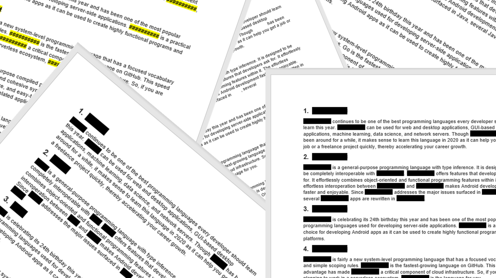

# The Redactor

## Author

### Bhavya Reddy Kanuganti
Email: bhavya.reddy.kanuganti-1@ou.edu

# Project Description

The data that has been shared with public has few sensitive detals
that has to be redacted. The sensitive data may include names, phone numbers, addressses and 
other data that may reveal the identity of a person. In this project the names, gender revealing words, dates, phone numbers, 
addresses, and a sentence regarding a specific concept word are redacted  with full block character █ (U+2588).

### Flags

- --input
- --names
- --genders
- --dates
- --phones
- --address
- --concept
- --stats
- --output

# Packages Installed

- NLTK:averaged_perceptron_tagger, wordnet, omw-1.4
- RE
- OS
- SYS

## Dataset:
In the tmp directory few text files from [Enron Email Dataset](https://www.cs.cmu.edu/~enron/) have been taken for 
redacting the sensitive data.

# Files and Function Description

redactor.py, main.py, test_names.py, test_genders.py, test_dates.py, test_phonenumber.py, 
test_address.py, test_concept.py are the files used in this code

## redactor.py

All the functions defined in the main.py file are called in redactor.py file for execution.
## main.py

The definitions of the function are given in main.py file, it is inside the project1 directory.

## Function Description

### textdata(docs):

In txtdata(docs) function we open and read each file from docs and read the data and append it.
Th whole data of all the files in docs is returned in this function.

### redact_name(data):

The function takes data as an argument. The data is being sentence tokenized using 
"nltk.sent_tokenize(data)", the sentence tokenized data is then word tokenized and then parts of speech 
is identified using "nltk.ne_chunk(nltk.pos_tag(nltk.word_tokenize(i)))"
If the part of speech is a person then that word is being redacted with full block character █ (U+2588)
and is being replaced in data using .replace(). The redacted words are stored in a list and if any duplicates 
are found then they are removed using for loop and appended to a new name list. The data and names are returned in this function. 

### redact_gender(data):

The function takes data as an argument. Most of the gender words are being given in gender list.
The data is word tokenized and if the words in the given list match with the words in data then those 
words are redacted with block character and is replaced in data. The redacted words are stored in a list and if any duplicates 
are found then they are removed using for loop and appended to a new gender_word list. The data and gender_word are returned in this function. 

### redact_date(data):

Regex pattern is taken to match the dates in data using re.findall(pattern, data)
Then if elements in match are matched with data then that data is redacted. The redacted words are stored in a list and if any duplicates 
are found then they are removed using for loop and appended to a new date list. The data and date are returned in this function. 
The given regex pattern detects the following patterns of dates:

- 2/10/2009
- 17/2/2009
- 17 Feb 2009
- 15 October 1999
- December 5 2009
- May 25th 2020
- May 3rd, 2009
- Oct 22, 2021

### redact_phnumber(data):

The redact_phnumber takes data as an argument. Different types of phone number regex patterns
are assigned to pattern and using re.findall() the pattern is matched, redacted and then replaced in data.
 The redacted words are stored in a list and if any duplicates 
are found then they are removed using for loop and appended to a new phone list. The data and phone are returned in this function. 
The given regex pattern detects the following patterns of phone numbers:

- 854-235-6526
- (134) 239-0394
- 113 976 1457
- +91 (763) 123-0877
- +1 (234) 886-0987

### redact_address(data):

This function is used to redact the address fields in data.
The function takes data as an argument. The address regex pattern is assigned to pattern
and then if there is a similar pattern in data then, it is redacted and is replaced in data.
The redacted words are stored in a list and if any duplicates 
are found then they are removed using for loop and appended to a new address list. The data and address are returned in this function. 
Few of the address patterns that are detected by the specified regex pattern are:

- 2657 Classen Blvd
- 7 Fifth Ave
- 100 21st St
- 1313 E Main St
- 743 Driftwood Road
- 1045 American Drive

### concept(word,data):

The function takes 2 arguments word and data. The word is the list of args.concept.
For this function we need to import nltk.corpus and wordnet from nltk.corpus.
We use the synsets method and syn.lemma() property and assign the synonyms to the list 
with for loop. The data is then sentence tokenized and then checked if any element of synonyms list
matches with the data then the whole sentence is redacted.

### stats(args,name,gender_words,date,phone,address,synsentences):
In the stats function we take the list of names, gender words, dates, phone numbers, addresses and concept sentences that 
have been redacted and take the count of each list. If args.stats is stderr then a stderr file is created and the data is printed on the terminal using sys.stderr and write command, if args.stats is stdout then a stdout file is created and the data is printed on the terminal using sys.stdout and write command. 

### output(args, data):

In this function all the redacted text files are written to outputfiles
directory with original name and .redacted extension.

## Test files

We have to import pytest and main from project1 to execute these files.

### test_names.py: 

The file test_names.py is used to test if the names have been redacted from a line. 
It is checked using 'assert test is not None'.

### test_genders.py:

The file is test_genders.py used to test if the gender revealing words have been redacted from a line. 
It is checked using 'assert test is not None'. 

### test_dates.py: 

The file test_dates.py is used to test if the dates have been redacted from a line. 
It is checked using 'assert test is not None'.

### test_phonenumber.py: 

The file test_phonenumber.py is used to test if the phone numbers have been redacted from a line. 
It is checked using 'assert test is not None'. 

### test_address.py:

The file test_address.py is used to test if the addresses have been redacted from a line. 
It is checked using 'assert test is not None'. 

### test_concept.py:

The file test_concept.py is used to test if the sentence related to the word
has been redacted. 
It is checked using  'assert test is not None'. 

# Execution

The following command has to be used to run the redactor.py file:

pipenv run python redactor.py --input '*.txt' \
--names --dates --phones --genders --address\
                    --concept 'kids' \
                    --output 'files/' \
                    --stats stderr`

 

pipenv run python redactor.py --input "C:\Users\Bhavya\PycharmProjects\cs52393sp22-project1\tmp/*.txt" 
                    --names 
                    --dates 
                    --phones 
                    --genders 
                    --addresses 
                    --concept 'word' 
                    --stats "C:\Users\Bhavya\PycharmProjects\cs52393sp22-project1\stderr\stderr.txt"
                    --output "C:\Users\Bhavya\PycharmProjects\cs52393sp22-project1\outputfiles"

The following command has to be used to run the test file

pipenv run python -m pytest

## Externsl Links:
https://nanonets.com/blog/named-entity-recognition-with-nltk-and-spacy/ - helped in redacting names.

https://wmich.edu/writing/rules/addresses: helped in writing regex for addresses.

https://www.holisticseo.digital/python-seo/nltk/wordnet - helped with concept function.

https://www.askpython.com/python/python-stdin-stdout-stderr - helped with stats function
